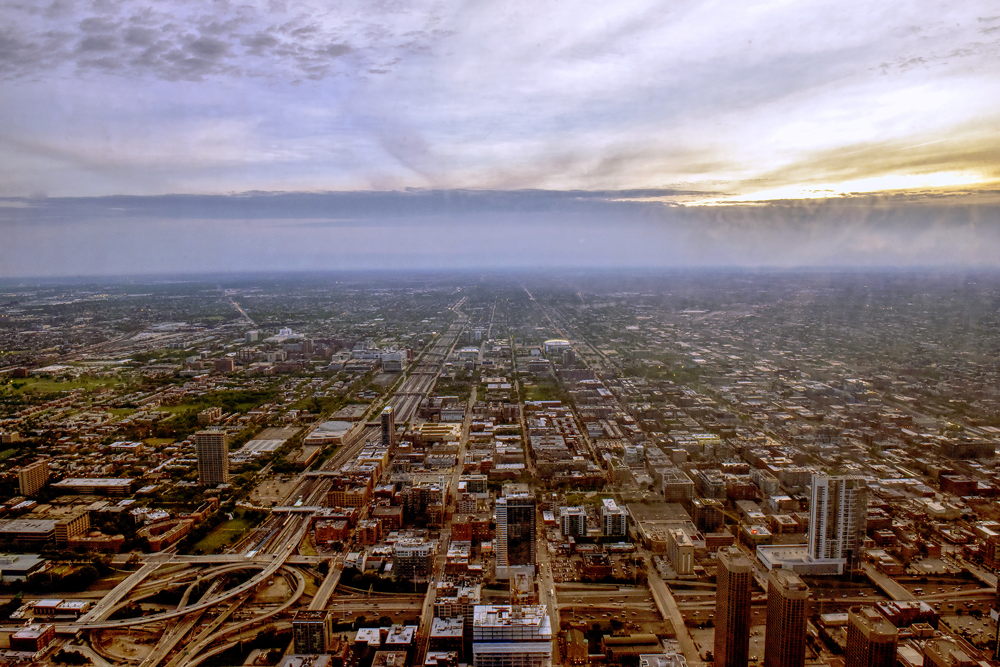

Paralmax.js
===========

A parallax effect plugin that can ensure the background size covers the whole container without causing any white space around and it is also responsive for any devices.


### Link to Files

```html
<script src="https://ajax.googleapis.com/ajax/libs/jquery/3.2.1/jquery.min.js" type="text/javascript"></script>
<script src="js/paramax.js" type="text/javascript"></script>
```

### Set up Codes

#### HTML Code

Simply add class .parallax-object to the elements that you want to parallax.

```html
<div class="parallax-object">
    
</div>
```

#### JQuery Call

```javascript
jQuery(function($){

    // PARALLAX FUNCTIN CALL
    $(".parallax-object").each(function() {
        parallaxObject($(this));
    });

});
```

No built-in CSS is used/necessary, just style your elements to however you like before you parallax them.

### HTML Data Options

#### Speed ( float, from 0.x to x.0 )

0 means the parallax element will be fixed in place, in this case, you don't need Paralmax. 1 means the same speed as page scoll, x.0 Means x times of the page scrolling speed. Default is 0.5.

#### Resize ( boolean, true or false )

Resize ( boolean, true or false )

```html
<div data-resize="true"></div>
```

#### Breakpoint ( boolean, true or false )

Disable paralalx effect while below the specific screen size.

```html
<div data-breakpoint="768"></div>
```